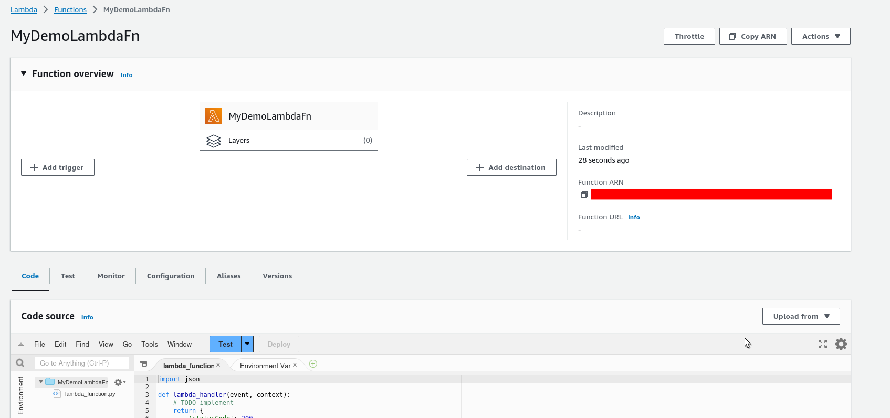
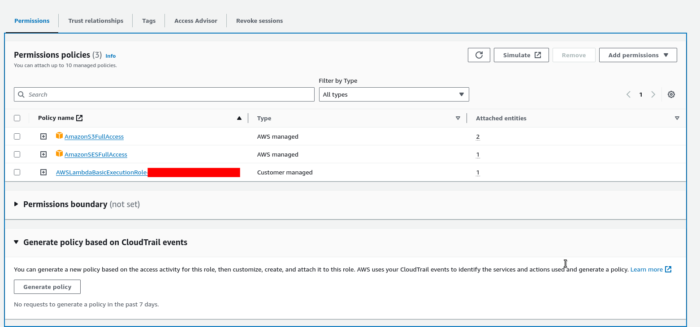
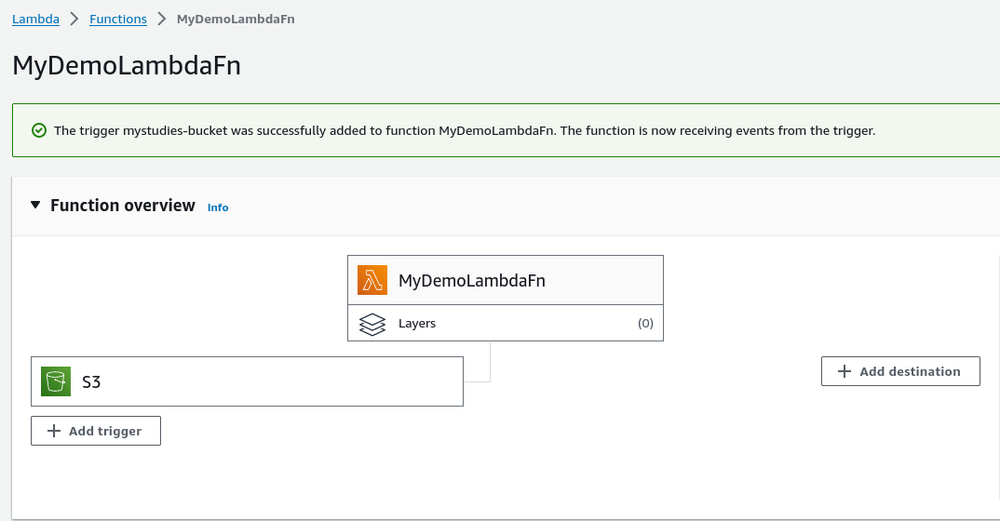
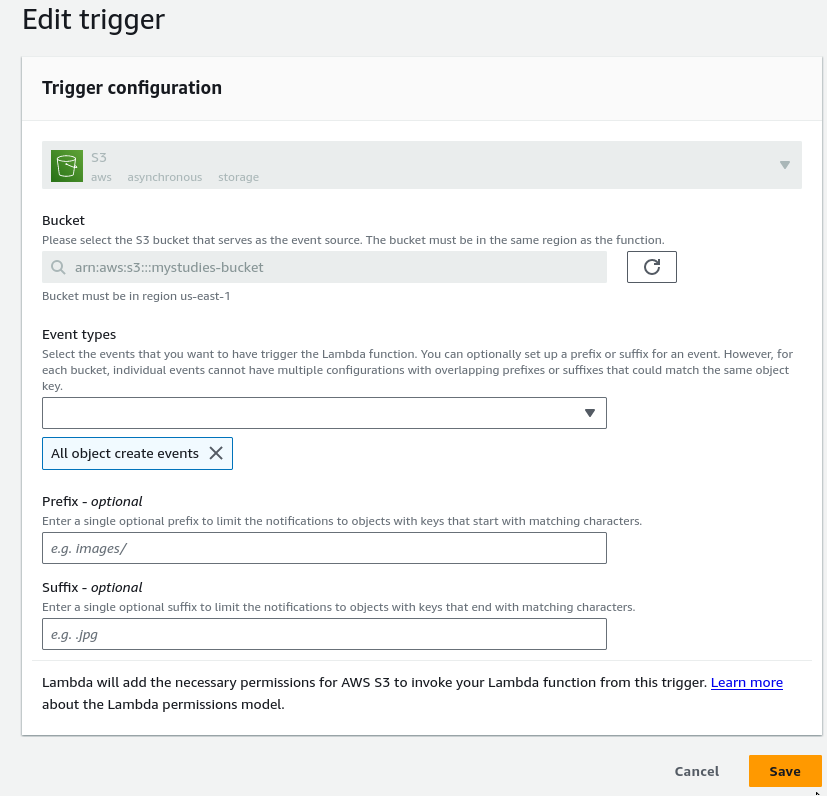
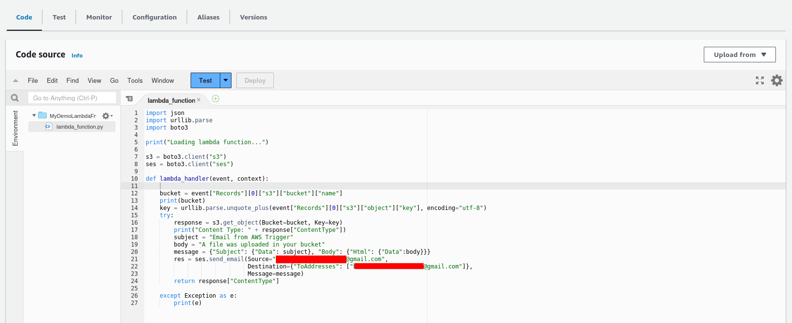
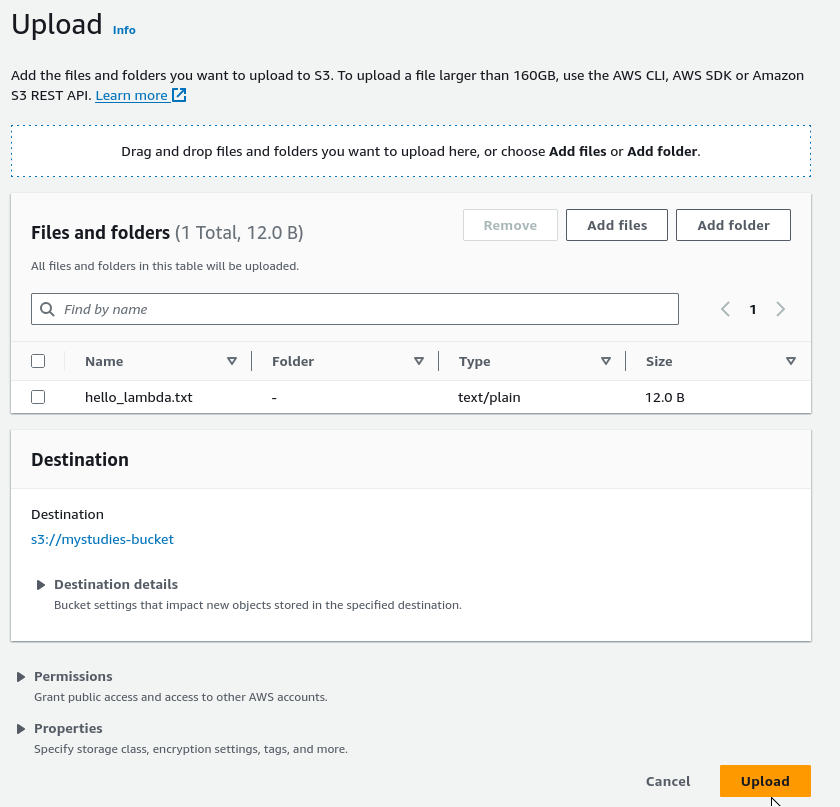
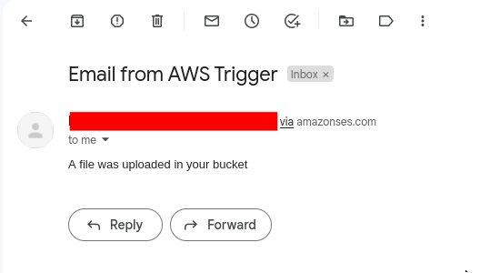
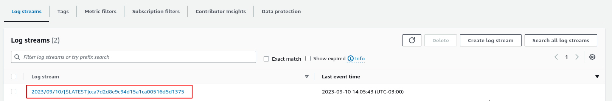
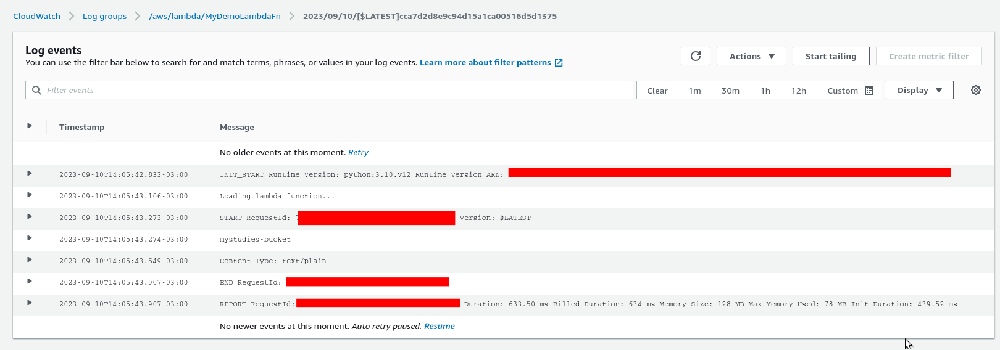

# Lambda (S3) Bucket Upload

A simple lambda application that will send an email when any file uploaded to a bucket (S3).

- Go to [AWS Lambda Console](https://console.aws.amazon.com/lambda/home) and hit the button `Create a function`
- Choose `Author from scratch`
- Runtime choose `Python 3.x` (I'm using Python 3.10)
- In execution role mark the `Create a new role with basic Lambda permissions`
- Click on `Create a function`



- Before, we need to create an identity in [Amazon Simple Email Service Console](https://console.aws.amazon.com/ses/home) and `create identity`, choose `email` and create (you need to verify the email in your mailbox)
- Go back to the `lambda function` &rarr; `Configurations` &rarr; `Permissions` and click on the `role name id`. Go to `Add permissions` &rarr; `Attach policies` and give the permissions: `AmazonSESFullAccess` - `AmazonS3FullAccess`



- In the lambda console, click on `Add trigger` in `Select source` choose `S3` and create it





- When we upload any file to the bucket, it will trigger our lambda function and send an email. I'll use [lambda_function.py](./lambda_function.py)


```python
import json
import urllib.parse
import boto3

print("Loading lambda function...")

s3 = boto3.client("s3")
ses = boto3.client("ses")

def lambda_handler(event, context):
    
    bucket = event["Records"][0]["s3"]["bucket"]["name"]
    print(bucket)
    key = urllib.parse.unquote_plus(event["Records"][0]["s3"]["object"]["key"], encoding="utf-8")
    try:
        response = s3.get_object(Bucket=bucket, Key=key)
        print("Content Type: " + response["ContentType"])
        subject = "Email from AWS Trigger"
        body = "A file was uploaded in your bucket"
        message = {"Subject": {"Data": subject}, "Body": {"Html": {"Data":body}}}
        res = ses.send_email(Source="<your_email_here>",
                             Destination={"ToAddresses": ["<your_email_here>"]},
                             Message=message)
        return response["ContentType"]
    
    except Exception as e:
        print(e)
```

- Copy and paste the code above in the `code` and click on `deploy`



- I'll upload a file [hello_lambda.txt](./hello_lambda.txt) using the [S3 Console](https://console.aws.amazon.com/s3/buckets). When hit the upload button, an email will be sent to my mailbox.



- The email received after upload the file in S3:



- **Optional:** You can check the Logs in `Monitor` &rarr; `View CloudWatch logs`





---
<p align="center">
  <strong>Created by BrenoAV</strong>
</p>